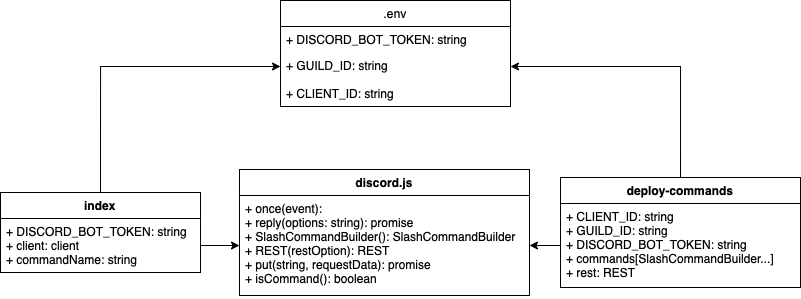

# Project 
Short Description of Project:
- It is a Discord bot that utilizes Canvas API to allow users to interact with Canvas in Discord. It is only for personal use, so only a personal Canvas key / token is required for the bot to interact with Canvas. 

Link to Original Project Proposal:
- https://github.com/CIS3296SoftwareDesignF21/feedback-on-proposals-section-005-m-w-3-30pm/issues/4

Link to Trello Board:
- https://trello.com/b/pkIZaP5j/project-management-board

Vision Statement: 
- For college students who utilize Discord servers for their college classes and whose colleges utilize Canvas, the Canvas Discord Bot is a Discord bot that facilitates communication between the Discord server and the corresponding college class the server is centered around. Unlike the previous solution, which required users to go back and forth between the Discord and Canvas applications, users of the Canvas Discord Bot can use simple commands within their Discord servers to pull information about their classes from Canvas without leaving the application. This provides simple, fast, and convinient access to Canvas in Discord with just text commands, and no need to navigate into Canvas. It could improve Discord users' awareness of their Canvas's activities.

Three Personas:
1. Dane, age 20, is a college student at Temple University in urban Philadelphia, Pennsylvania. He has used the internet for as long as he can remember, and is an avid player of video games. Many times in the past and in the present, Dane has used Discord for communication with friends and teammates in the video games he plays every night. Dane is a computer science major at Temple, and the crafty students in his classes always create a Discord server for classmates to discuss projects and assignments for each class. Dane loves communicating in these servers, and enjoys the collaboration between classmates. He is interested in the Canvas Discord bot in order to receive notifications about when assignments in his classes are due, in addition to being notified about announcements from his professor. 

2. Steve is a freshman student who specializes in CS. He uses discord primarily for classes and gaming. He would use discord whenever he is on his computer, and knows every feature Discord provides. He is familiar with discord bots and has been maintaining multiple servers. He would be interested in and like to have the bot added to his servers. Thus, he could make any necessary adjustments to the bot and have it avaiable for himself and people of his servers.

3. Professor Steven is computer science professor and in every single one of his classes he is a part of a discord server that allows him to communicate with his students. He spends a lot of time clarifying canvas assignments to his students and reminding them of due dates. Being a cs professor he is aware that there could be a product that makes his life a lot easier and takes out the human element in reminding students to complete their assignments and clarifying homeworks. When he discovers the discord bot he creates a server with the plugin every single time and it streamlines his communication with the students to such a point that he must only handle unexpected circumstances like unforseen abiguities.

# How to Run
1. Clone the repository to your computer
2. Move into the directory of the project
3. Create a file in the directory called “.env” with the format found in [.env.example](.env.example)
4. Instructions to configure the Node app and run the bot are below:
5. run ```npm install``` to install node dependencies
6. run ```npm install -g nodemon``` to install node dev. Dependencies
7. run ```node .``` or ```node index.js``` to start the bot

# How to Install
Prerequisite: Node Package Manager (NPM)

Clone the repository to your computer, follow the instructions above. 

# Week 1 Tasks
[week1.md](week1.md)

# Week 2 Tasks
[week2.md](week2.md)

# UML Diagram



A UML diagram was created to help those who are new to the project understand the architecture of the project. The diagram currently contains details on two classes, the environment variable file, and the discord.js library. Both [index.js](index.js) and [deploy-commands.js](deploy-commands.js) are linked to the .env file and recieve the various private keys for their use. [index.js](index.js) and [deploy-commands.js](deploy-commands.js) use functions and classes from the discord.js package, and these methods are listed in the diagram under discord.js. 

[index.js](index.js) performs the initial connection to the Discord bot and logs it into the server using the client variable. Index.js also recognizes command inputs and provides the response to the server.

[commands/deploy-commands.js](commands/deploy-commands.js) defines the commands the bot can recognize and performs the REST api connection to register the commands within the server the bot is connecting to. Every modification toward the file only requires a single run of the file to register and update the bot's commands.

[commands/commands.js](commands/commands.js) contains functions that interect with Canvas LMS API. The unction initial HTTPS requests to the api and receives JSON objects.
